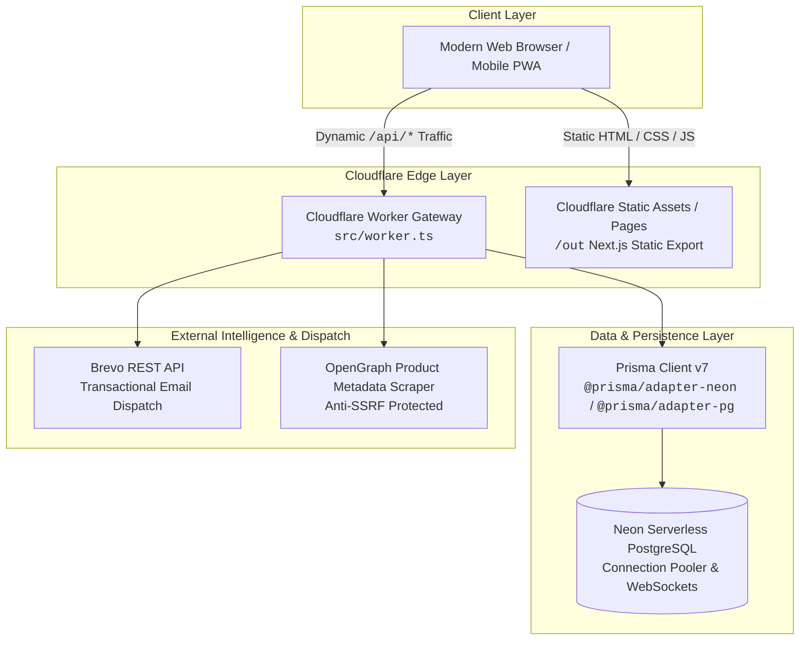
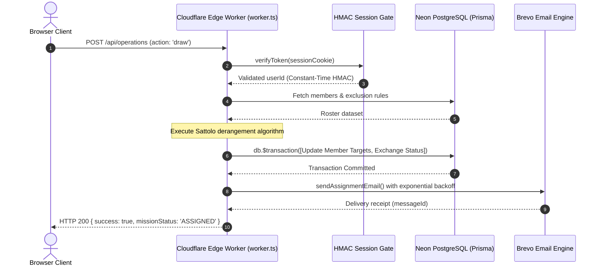
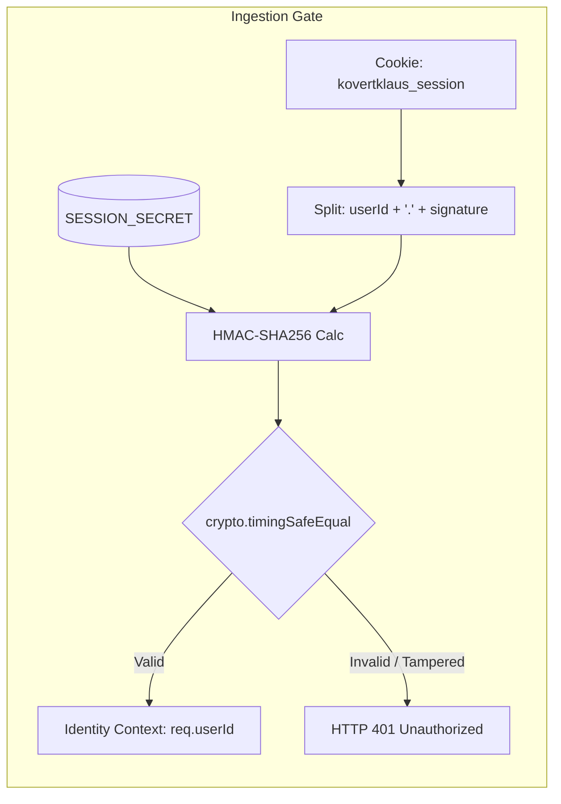
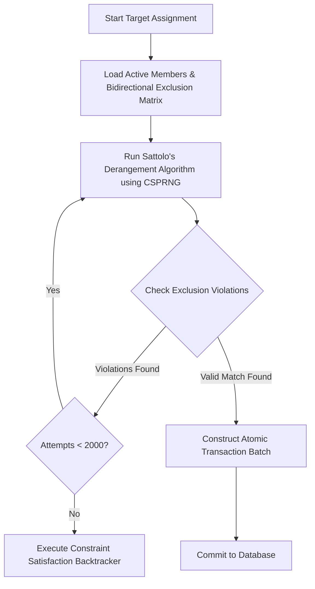
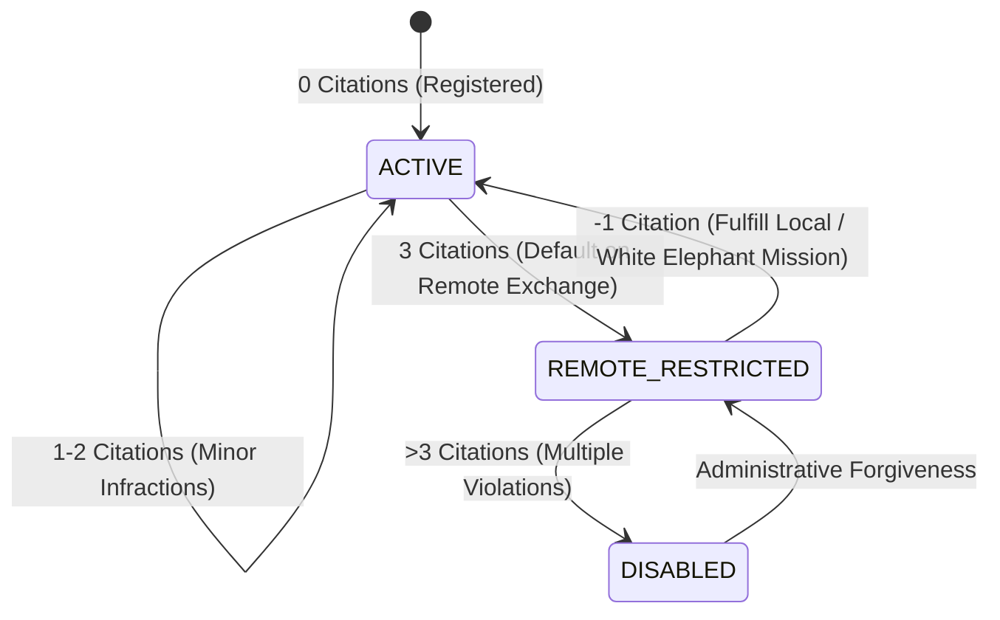
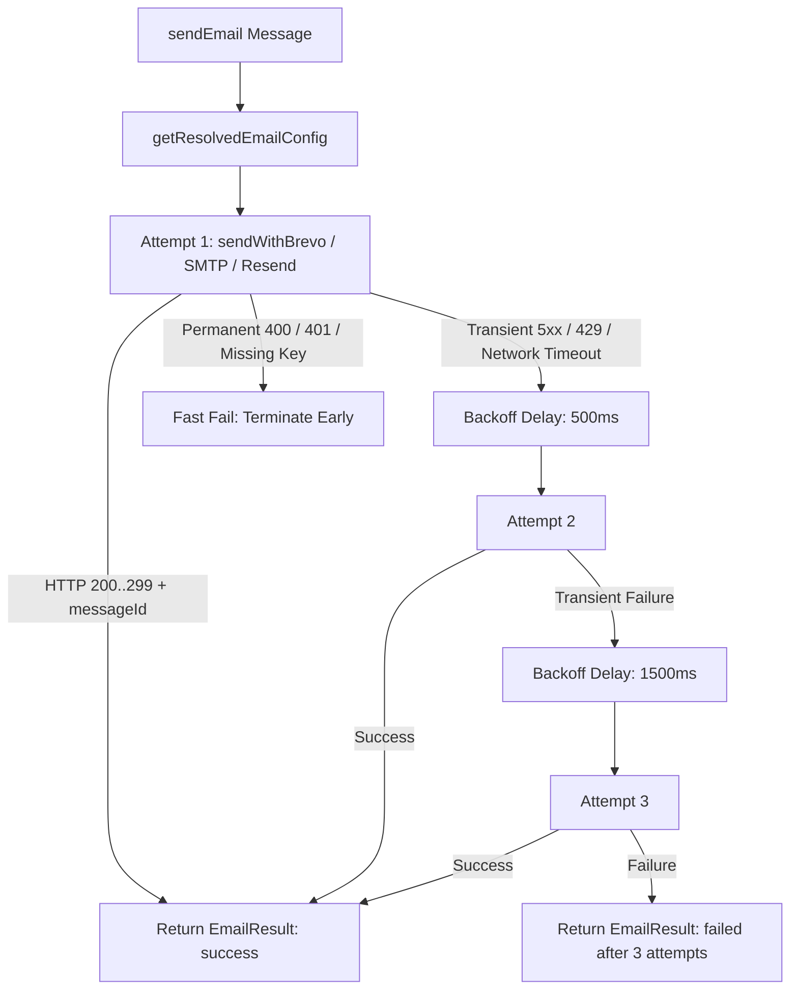

# KovertKlaus — Technical Architecture Specification 🕵️‍♂️🎄

**Document Version:** 1.0.0  
**Target Release:** `v0.1.0-prealpha` ➔ `v1.0.0-beta`  
**Classification:** Public Engineering Specification  

---

## 1. Executive Summary & System Overview

**KovertKlaus** is a covert intelligence gift exchange network and reliability management platform designed for families, friends, communities, and enterprise teams. The system transforms standard Secret Santa and White Elephant gift exchanges into interactive holiday missions governed by automated reliability tracking (Coal Citations), reusable Wishlist Manifests, 100% bidirectional match exclusion matrices, cryptographic session integrity, and a hybrid Cloudflare Edge Worker + Serverless PostgreSQL architecture.

---

## 2. Canonical Domain Nomenclature

To preserve the tactical covert holiday aesthetic, KovertKlaus establishes standard domain mappings across code, schemas, and user interfaces:

| Domain Concept | Canonical Term | Code Symbol | Database Entity | Scope & Semantics |
| :--- | :--- | :--- | :--- | :--- |
| **Event Organizer** | **`Head Elf`** | `organizer` / `OpsLeader` | `User` / `Exchange.organizerId` | Creator and administrative leader of a holiday mission. |
| **Participant** | **`Elf Agent`** | `member` / `Agent` | `ExchangeMember` / `User` | Operative enrolled in the mission roster. |
| **Gift Exchange** | **`Holiday Mission`** | `exchange` / `Operation` | `Exchange` | The overarching gift exchange event (Secret Santa or White Elephant). |
| **Wishlist Container** | **`Wishlist Manifest`** | `manifest` / `OpKit` | `Wishlist` | Curated collection of desired gift items. |
| **Individual Gift Item** | **`Manifest Item`** | `item` / `OpTool` | `Item` / `WishlistItem` | Product listing containing title, URL, price, and thumbnail. |
| **Reliability Penalty** | **`Coal Citation`** | `demerit` / `penalty` | `User.penaltyPoints` | Reliability penalty point issued for unexcused deadline default. |

---

## 3. Hybrid Edge & Next.js App Router Architecture

KovertKlaus utilizes an open-core hybrid deployment model:

### Static Prerendering + Edge Runtime Routing
1. **Next.js Static Export (`/out`)**: All UI pages (`/`, `/dashboard`, `/exchange/[code]`, `/workshop`, `/northpole`) are statically prerendered at build time using `export const dynamic = 'force-static'` for instant global CDN delivery.
2. **Cloudflare Worker Gateway (`src/worker.ts`)**: Dynamically intercepts all incoming `/api/*` endpoints at the edge, authenticates sessions via HMAC-SHA256, connects to Neon PostgreSQL over secure WebSockets (`@neondatabase/serverless`), and executes business logic with 0ms cold starts.
3. **Local Dev / Node.js Parity**: Next.js route handlers in `src/app/api/**/route.ts` maintain exact behavioral and algorithmic parity with `src/worker.ts` for self-hosted Docker and local development.

---

## 4. Cryptographic State & Defensive Security Pipeline

### Core Security Invariants
- **Cryptographic State & Session Signing**: Session tokens take the format `userId.signature`. Signatures are generated using `crypto.createHmac('sha256', secret)` and verified with `crypto.timingSafeEqual` to prevent timing attacks. Raw, unsigned UUIDs are rejected unconditionally.
- **Zero Identity Fallbacks**: Authenticated endpoints derive the active operator's identity strictly from the verified session context. Body identity overrides (e.g. `body.userId`) and query parameters (`?userId=...`) are explicitly ignored or rejected.
- **Server-Side PII Isolation**: Secret Santa target assignments, recipient physical addresses, and exclusion rule matrices are filtered at the database query layer. Operatives only receive data for their assigned target.
- **Anti-SSRF Web Scraper**: The OpenGraph product scraper in `src/lib/scraper.ts` strictly validates protocols (`http:`, `https:`), blocks non-standard IP formats (decimal, hexadecimal, octal), blocks private RFC 1918 CIDRs, DNS rebinding wildcard domains, loopback, and cloud metadata endpoints (`169.254.169.254`), and enforces `redirect: 'error'`.

---

## 5. Target Matching Derangement Engine (`src/lib/draw.ts`)

KovertKlaus guarantees that **no participant can draw themselves** ($A \neq B$) and that all active 100% bidirectional exclusion rules ($A \iff B$) are strictly satisfied.

### Algorithmic Highlights
- **Sattolo Derangement Algorithm**: Generates a single uniform cyclic derangement of length $N$ in $O(N)$ time using cryptographically secure random integers (`crypto.getRandomValues`).
- **Bidirectional Exclusion Indexing**: Rules are indexed into a bidirectional lookup set `blockedSet` in $O(E)$ time, enabling $O(1)$ match validation during candidate shuffling.
- **Constraint Satisfaction Backtracker**: If rapid stochastic shuffling does not find a valid permutation within 2,000 attempts due to dense exclusion constraints, a deterministic backtracking solver runs to find the optimal assignment.
- **2-Way Cascade Swapping**: Organizers can execute manual target adjustments without breaking cycle integrity. If $A \to T_1$ is changed to $A \to T_2$, the displaced giver $B$ is automatically updated to $B \to T_1$ in an atomic 2-way cascade.

---

## 6. Demerit Governance & Rehabilitation State Machine (`src/lib/demerits.ts`)

KovertKlaus operates under the **Platform Non-Intermediary Principle**: the platform provides automated reliability accounting (Coal Citations) without manual administrative arbitration.

### Standing Tiers
1. **`ACTIVE` (0–2 Coal Citations)**: Unrestricted access to all remote (shipping) and local holiday missions.
2. **`REMOTE_RESTRICTED` (3 Coal Citations)**: Restricted strictly to in-person and local events (`isLocalOnly: true`). Remote shipping missions are locked.
3. **`DISABLED` (>3 Coal Citations)**: Account suspended from creating or joining operations.

### Defensive Waivers & Rehabilitation
- **Carrier Protection Waiver**: Submitting a valid carrier tracking number (`USPS`, `UPS`, `FedEx`, `DHL`, `Amazon Logistics`) grants automated immunity against demerit penalties if a parcel is lost in transit.
- **Automated Rehabilitation Engine**: Successfully completing any subsequent exchange automatically removes **`-1` Coal Citation** (`Math.max(0, penaltyPoints - 1)`). When points drop below 3, standing is automatically restored to `ACTIVE`.

---

## 7. Universal Transactional Email Dispatcher (`src/lib/email/*`)

### Key Capabilities
- **Multi-Provider Priority Engine**: Auto-detects configuration in order: Brevo REST API ➔ Direct SMTP (`nodemailer`) ➔ Resend API ➔ Console Mock.
- **Exponential Backoff Retry Engine**: Automatically retries transient network failures, timeouts, rate limits (429), and 5xx server errors across 3 attempts (`500ms`, `1500ms`, `3000ms`).
- **Edge Runtime Compatible**: Brevo REST and Resend implementations use zero-dependency native `fetch()`, guaranteeing 100% compatibility with Cloudflare Workers.

---

## 8. North Pole Command Center & Lookup-Only I/O Architecture

To ensure platform scalability with 10,000+ registered operatives and holiday operations, North Pole administrative portals (`/northpole/users`, `/northpole/operations`, `/northpole/leads`) use a **Lookup-Only Architecture**:
- **Zero Initial DB Dumps**: Pages mount with 0 upfront table scans.
- **On-Demand Single-Record Lookups**: Admins query by specific User ID (`?id=...`), Email, Codename, or Operation Code (`?code=...`), transferring only matching records across the wire.
- **Live In-Place Mutations**: Demerit points, Workshop clearance tags, and codenames are modified directly from the inspector interface.
