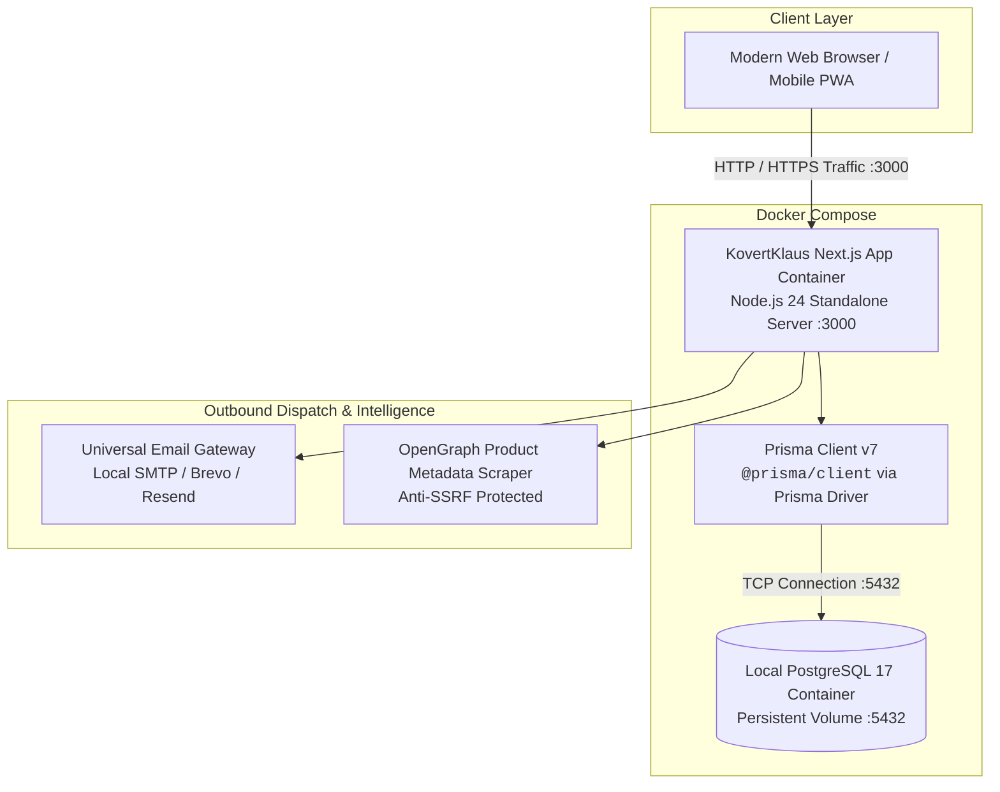
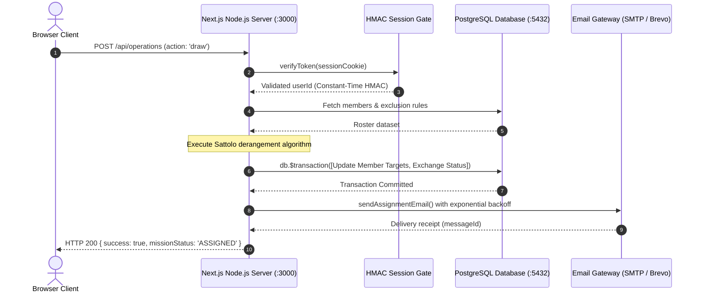
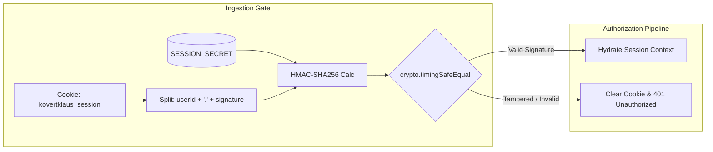

# KovertKlaus — Self-Hosted Technical Architecture Specification 🕵️‍♂️🎄

**Document Version:** 1.0.0 (Self-Hosted Edition)  
**Target Release:** `v0.1.0-prealpha` ➔ `v1.0.0-beta`  
**Classification:** Open-Core Self-Hosted Architecture  

---

## 1. Executive Summary & System Overview

**KovertKlaus** is a self-hosted covert intelligence gift exchange network and reliability management platform designed for families, friends, communities, and home-lab enthusiasts. The system transforms standard Secret Santa and White Elephant gift exchanges into interactive holiday missions governed by automated reliability tracking (Coal Citations), reusable Wishlist Manifests, 100% bidirectional match exclusion matrices, cryptographic session integrity, and an isolated containerized Docker stack.



---

## 2. Canonical Domain Nomenclature

To preserve the tactical covert holiday aesthetic, KovertKlaus establishes standard domain mappings across code, schemas, and user interfaces:

| Domain Concept | Canonical Term | Code Symbol | Database Entity | Scope & Semantics |
| :--- | :--- | :--- | :--- | :--- |
| **Event Organizer** | **`Head Elf`** | `organizer` / `OpsLeader` | `User` / `Exchange.organizerId` | Creator and administrative leader of a holiday mission. |
| **Participant** | **`Elf Agent`** | `member` / `Agent` | `ExchangeMember` / `User` | Operative enrolled in the mission roster. |
| **Gift Exchange** | **`Holiday Mission`** | `exchange` / `Operation` | `Exchange` | The overarching gift exchange event (Secret Santa or White Elephant). |
| **Wishlist Container** | **`Wishlist Manifest`** | `manifest` / `OpKit` | `Wishlist` | Curated collection of desired gift items. |
| **Individual Gift Item** | **`Manifest Item`** | `item` / `OpTool` | `Item` / `WishlistItem` | Product listing containing title, URL, price, and thumbnail. |
| **Reliability Penalty** | **`Coal Citation`** | `demerit` / `penalty` | `User.penaltyPoints` | Reliability penalty point issued for unexcused deadline default. |

---

## 3. Containerized Next.js App Router Architecture

KovertKlaus is packaged as a high-performance, single-command Docker deployment:



### Self-Hosted Run-time Components
1. **Next.js Standalone Server (`kovertklaus-app`)**: Multi-stage Alpine Linux container compiling Next.js with Turbopack and serving both React Server Components and dynamic API endpoints.
2. **PostgreSQL Database (`kovertklaus-db`)**: Official PostgreSQL image with healthcheck triggers, automated schema synchronization via `prisma db push`, and persistent named volume storage (`postgres_data`).
3. **Local & Cloud Email Flexibility**: Native support for standard self-hosted SMTP relays (Postfix, Mailcow, SendGrid, Gmail SMTP) or Brevo/Resend REST APIs.

---

## 4. Cryptographic State & Defensive Security Pipeline



### Security Invariants:
1. **Timing-Safe Session Verification**: Constant-time `crypto.timingSafeEqual` prevents timing attacks on cookie validation.
2. **OWASP A01 SSRF Defensive Scraper**: The metadata scraper validates IP addresses before making HTTP requests, blocking internal subnet attacks (`127.0.0.1`, `10.0.0.0/8`, `192.168.0.0/16`, AWS metadata `169.254.169.254`, integer IPs, and DNS rebinding).
3. **Anti-Overwishing Budget Limits (+20%)**: Live validation blocks single items that exceed the event's configured hard cap, protecting group fairness.

---

## 5. Storage & Volume Management

```
/var/lib/docker/volumes/
└── kovertklaus_postgres_data/     <-- Persistent database files (PostgreSQL 17)
```

For complete deployment, backup, and environment configuration instructions, see [`docs/SELF_HOSTED_DEPLOYMENT.md`](SELF_HOSTED_DEPLOYMENT.md).
