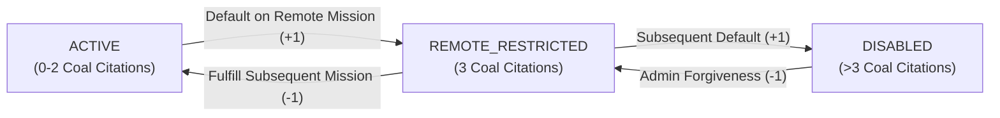

# KovertKlaus — Demerit & Reliability System Specification ⚖️

**Specification Version:** 1.0.0  
**Scope:** Automated Reliability Tracking & Rehabilitation Engine  

---

## 🎯 1. The Platform Non-Intermediary Principle

KovertKlaus is an automated covert mission intelligence platform. To maintain neutrality, scalability, and trust:
- **Zero Administrative Arbitration**: Platform administrators and North Pole support do **NOT** arbitrate disputed gifts or subjective dissatisfaction.
- **Strict Evidence Requirement**: Coal Citations are only issued for verified, objective non-compliance: failure to ship a gift by the deadline without submitting carrier tracking proof.
- **Direct Accountability**: Demerit standing is strictly an operational governance standard between the Event Organizer (`Head Elf`) and the participant (`Elf Agent`).

---

## 📊 2. Standing Tiers & Privileges

Every registered operative holds an account standing determined by their accumulated Coal Citations (`penaltyPoints: 0-4+`):

| Standing Tier | Citation Count | Mission Creation | Remote Shipping Exchanges | Local / In-Person Exchanges |
| :--- | :--- | :--- | :--- | :--- |
| **`ACTIVE`** | `0 – 2` | ✅ Full Access | ✅ Allowed | ✅ Allowed |
| **`REMOTE_RESTRICTED`** | `3` | ⚠️ Local Only | 🚫 **LOCKED** | ✅ Allowed (`isLocalOnly: true`) |
| **`DISABLED`** | `> 3` | 🚫 Suspended | 🚫 Suspended | 🚫 Suspended |

---

## 🛡️ 3. Defensive Waivers & Automated Immunity

To prevent false-positive citations caused by third-party shipping delays or postal losses, KovertKlaus enforces two automated protection rules:

### Rule 1: Carrier Protection Waiver
If an operative enters a valid carrier tracking number (`USPS`, `UPS`, `FedEx`, `DHL`, `Amazon Logistics`) on or before the Execution Day, the system automatically grants **Carrier Protection Immunity**. If the parcel is delayed or lost by the postal carrier, zero demerit points are assessed against the sender.

### Rule 2: Execution Day Audit Gate
Demerit audits cannot be executed prior to the official scheduled `executionDate`. Organizers cannot prematurely penalize operatives while the shipping window remains open.

---

## 🔄 4. Automated Rehabilitation & Redemption Engine

KovertKlaus believes in restorative holiday justice. Operatives who accumulate Coal Citations can naturally rehabilitate their reputation:

1. **`-1` Demerit on Mission Fulfillment**:
   Every time an operative successfully fulfills a holiday mission (either by participating in a local exchange, White Elephant, or having their gift confirmed), the system decrements their citation count by 1:
   $$\text{New Penalty Points} = \max(0, \text{Current Penalty Points} - 1)$$
2. **Automatic Reinstatement to `ACTIVE`**:
   The moment an operative's citation count drops from 3 to 2, the system automatically lifts their `REMOTE_RESTRICTED` status and restores full `ACTIVE` standing across all remote shipping operations.

---

## 🧪 5. Automated Audit Test Matrix

The Demerit Engine is continuously verified via [`src/lib/demerits.test.ts`](file:///C:/Users/Joshua/projects/kovertklaus/src/lib/demerits.test.ts):
- Intentional neglect triggers `+1` Coal Citation.
- Reaching 3 citations triggers `REMOTE_RESTRICTED`.
- Carrier tracking numbers grant automated penalty immunity.
- Successful fulfillment removes `-1` Coal Citation.
- Points dropping below 3 restores `ACTIVE` standing.
