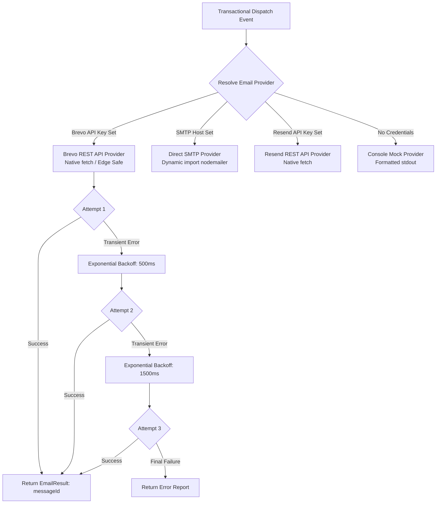

# KovertKlaus — Universal Transactional Email Dispatcher ✉️

**Specification Version:** 1.0.0  
**Scope:** Multi-Provider Email Engine with Exponential Backoff Retries  

---

## 📬 1. Overview & Architecture

KovertKlaus features a pluggable, zero-external-dependency Universal Email Dispatcher located in `src/lib/email/*`. It is engineered to operate seamlessly across both serverless edge runtimes (Cloudflare Workers) and standard Node.js server environments.



---

## ⚙️ 2. Provider Priority & Auto-Detection

The dispatcher resolves configuration precedence in the following order:

1. **Explicit Setting**: `EMAIL_PROVIDER="brevo" | "smtp" | "resend" | "console"`
2. **Auto-Detection**:
   - If `BREVO_API_KEY` is present $\to$ **`brevo`**
   - If `SMTP_HOST` is present $\to$ **`smtp`**
   - If `RESEND_API_KEY` is present $\to$ **`resend`**
   - Default fallback $\to$ **`console`** (zero setup required for local dev)

---

## 🔁 3. Exponential Backoff Retry Engine

Transactional messages (invitations, target draws, nudges, waitlist clearance confirmations) are protected by automatic retry logic in `src/lib/email/dispatcher.ts`:

- **Maximum Retries**: 3 attempts
- **Backoff Interval Schedule**:
  - Attempt 1: Immediate
  - Attempt 2: $500\text{ ms}$ delay
  - Attempt 3: $1500\text{ ms}$ delay
- **Classification of Errors**:
  - **Retryable Errors**: HTTP 500, 502, 503, 504, 429 Rate Limits, socket timeouts, and network connection drops.
  - **Fatal Non-Retryable Errors**: HTTP 400 Bad Request, 401 Unauthorized (invalid API key), and missing required recipient fields terminate early to prevent wasteful attempts.

---

## 📋 4. Transactional Message Templates

All templates reside in `src/lib/email/templates.ts` and generate both responsive HTML and clean plaintext:

| Template Function | Trigger & Event | Rendered Content |
| :--- | :--- | :--- |
| `sendInvitationEmail()` | Operative recruited to mission | Mission Title, Organizer Name, Invite Code, and Join URL. |
| `sendAssignmentEmail()` | Target draw executed | Target Codename, Shipping Deadline, and Wishlist Link. |
| `sendNudgeEmail()` | Head Elf broadcasts reminder | Custom organizer message and Command Center action link. |
| `sendClearanceConfirmationEmail()` | Operative signs up on waitlist | Clearance Queue Position (`#42`), Launch status briefing. |

---

## 🧪 5. Testing & Verification

The Universal Email Dispatcher is verified via [`src/lib/email/email.test.ts`](file:///C:/Users/Joshua/projects/kovertklaus/src/lib/email/email.test.ts):
```bash
npx tsx src/lib/email/email.test.ts
```
Assertions validate config auto-detection, template HTML rendering, plaintext extraction, retry tracking, and fallback priority when database records contain empty strings.
