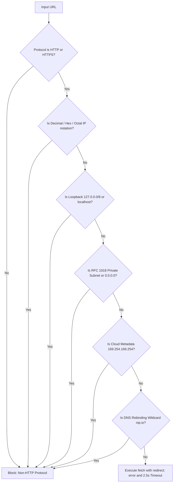

# KovertKlaus — Core Engineering & Security Invariants 🔒

**Document Version:** 1.0.0  
**Classification:** Core System Invariants & Enforcement Standards  

---

## 🏛️ 1. Cryptographic State & Sessions

> [!IMPORTANT]
> **Zero Unsigned Token Policy**:
> KovertKlaus will never issue or accept raw, unsigned identifiers (e.g. plain UUIDs) in cookies, query parameters, or request payloads.

1. **HMAC-SHA256 Signatures**:
   All session cookies (`kovertklaus_session`, `kovertklaus_admin_session`) and authentication headers contain an HMAC-SHA256 signature generated using `SESSION_SECRET`:
   $$\text{Token} = \text{userId} \parallel \text{"."} \parallel \text{HMAC-SHA256}(\text{userId}, \text{secret})$$
2. **Constant-Time Verification**:
   Signature validation uses `crypto.timingSafeEqual(expectedBuf, actualBuf)` to completely eliminate side-channel timing attack vectors.
3. **Invalidation on Tampering**:
   Any token with an invalid signature, corrupted payload, or empty string is rejected with an immediate `401 Unauthorized` without querying the database.

---

## 🛡️ 2. Parameter Tampering & Identity Isolation

1. **Single Source of Identity Truth**:
   The authenticated user's identity is derived exclusively from the cryptographically verified session context.
2. **Rejection of Client-Supplied Identity**:
   Mutating endpoints explicitly reject or ignore client-supplied identity overrides such as `body.userId` or `?userId=...`.
3. **Multi-Tenant / Mission Authorization**:
   Even if an operative has a valid session, mission actions (`draw`, `swap`, `addExclusion`, `closeRecruitment`) verify that `session.userId === exchange.organizerId`.

---

## 🌐 3. Strict Trust Boundaries & Anti-SSRF Defense

The OpenGraph product metadata scraper (`src/lib/scraper.ts`) accepts external URLs submitted by operatives. To prevent Server-Side Request Forgery (SSRF), all fetching logic enforces:

---

## 🗄️ 4. Concurrency, Atomic Transactions & Resource Lifecycle

1. **Atomic Mutation Boundaries**:
   All multi-entity updates (such as target assignment derangements, broadcast notifications, and cascade swaps) are executed inside atomic transactions (`db.$transaction([...])`). This guarantees data consistency and eliminates sequential $O(N)$ database round-trips.
2. **Explicit Connection Pool Teardown**:
   Database disconnects and cache invalidation routines explicitly await connection closure (`client.$disconnect()`, `pool.end()`) inside `try...catch` blocks to prevent dangling sockets.
3. **Relational Index Directives**:
   All foreign keys, status fields, and compound query paths (`ExchangeMember.exchangeId`, `ExchangeMember.userId`, `Wishlist.userId`, `Exchange.code`, `Item.url`) are backed by explicit Prisma schema index directives (`@@index`, `@unique`).
4. **Rejection-Sampled CSPRNG**:
   All random operations (Sattolo matching algorithm, session salt generation) use Web Crypto / Node CSPRNG (`crypto.getRandomValues`) with rejection sampling to eliminate modulo bias. `Math.random()` is strictly prohibited.
